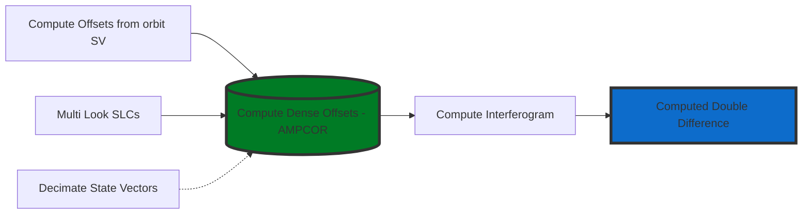

# ICEYE InSAR Processor

[![Language][]][1]

Interferometric processor for Synthetic Aperture Radar (SAR) data from the **[ICEYE][]**
satellite constellation based on **[GAMMA][]**.

**Installation**:

1. Setup minimal **conda** installation using [Miniconda][]

2. Create Python Virtual Environment

    > -   Creating an environment with commands ([Link][]);
    > -   Creating an environment from an environment.yml file
    >     ([Link][2]);

3. Install Python Dependencies

    > ``` bash
    > conda install -y scipy numpy matplotlib tqdm
    > ```

4. Install PyGamma - Python module permits a smooth usage of the Gamma
    Software within Python ([Link][3]);

---
### InSAR Workflow


**PYTHON DEPENDENCIES**:  
-   [py_gamma: Gamma Remote Sensing Python
    Integration][]
-   [numpy: The fundamental package for scientific computing with
    Python][]

  [Language]: https://img.shields.io/badge/python%20-3.7%2B-brightgreen
  [1]: ..%20image::%20https://www.python.org/
  [ICEYE]: ..%20image::%20https://www.iceye.com/
  [GAMMA]: ..%20image::%20https://www.gammasoftware.com/
  [Miniconda]: https://docs.conda.io/en/latest/miniconda.html
  [Link]: https://docs.conda.io/projects/conda/en/latest/user-guide/tasks/manage-environments.html#creating-an-environment-with-commands
  [2]: https://docs.conda.io/projects/conda/en/latest/user-guide/tasks/manage-environments.html#creating-an-environment-from-an-environment-yml-file
  [3]: https://gamma-rs.ch/uploads/media/upgrades_info_20210701.pdf
  [numpy: The fundamental package for scientific computing with Python]: https://numpy.org
  [py_gamma: Gamma Remote Sensing Python Integration]: http://www.gammasoftware.com/

